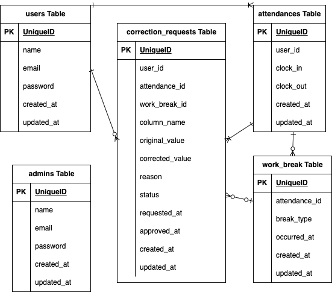

<h2>アプリケーション名</h2>

coachtech 勤怠管理アプリ

<h2>環境構築</h2>

1.ディレクトリの作成

2.Docker-compose.yml の作成

3.Nginx / PHP / MySQL / phpMyAdmin の設定

4.コンテナ起動 
docker-compose up -d --build 

5.Laravelプロジェクト作成 
docker-compose exec php bash 
composer create-project "laravel/laravel=8.*" . --prefer-dist

6.環境設定 
config/app.php で 'timezone' => 'Asia/Tokyo',へ変更 
.env.example をコピーして .env を作成し、必要に応じて環境変数を変更 
.env に SESSION_COOKIE=laravel_session を追加

<h2>テーブル構造</h2>

<h3>usersテーブル</h3>

| カラム名    | 型               | NULL許可 | 外部キー         | 備考           |
|-------------|------------------|----------|------------------|----------------|
| id          | unsigned bigint   | NO       |                  | 主キー         |
| name        | varchar          | YES      |                  |                |
| email       | varchar          | YES      |                  |                |
| password    | varchar          | YES      |                  |                |
| created_at  | timestamp        | YES      |                  |                |
| updated_at  | timestamp        | YES      |                  |                |

---

<h3>attendancesテーブル</h3>

| カラム名   | 型               | NULL許可 | 外部キー         | 備考           |
|------------|------------------|----------|------------------|----------------|
| id         | unsigned bigint   | NO       |                  | 主キー         |
| user_id    | unsigned bigint   | YES      | users(id)        |                |
| clock_in   | datetime         | YES      |                  |                |
| clock_out  | datetime         | YES      |                  |                |
| created_at | timestamp        | YES      |                  |                |
| updated_at | timestamp        | YES      |                  |                |

---

<h3>correction_requestsテーブル</h3>

| カラム名             | 型                                            | NULL許可 | 主キー | 外部キー             |
| ---------------- | -------------------------------------------- | ------ | --- | ---------------- |
| id               | unsigned bigint                              | NO     | ○   |                  |
| user\_id         | unsigned bigint                              | NO     |     | users(id)        |
| attendance\_id   | unsigned bigint                              | NO     |     | attendances(id)  |
| work\_break\_id  | unsigned bigint                              | YES    |     | work\_breaks(id) |
| column\_name     | enum('clock\_in','clock\_out','start','end') | NO     |     |                  |
| original\_value  | datetime                                     | NO     |     |                  |
| corrected\_value | datetime                                     | NO     |     |                  |
| reason           | text                                         | NO     |     |                  |
| status           | enum('pending','approved')                   | NO     |     |                  |
| requested\_at    | timestamp                                    | NO     |     |                  |
| approved\_at     | timestamp                                    | YES    |     |                  |
| created\_at      | timestamp                                    | YES    |     |                  |
| updated\_at      | timestamp                                    | YES    |     |                  |

---

<h3>work_breaksテーブル</h3>

| カラム名       | 型                      | NULL許可 | 外部キー           | 備考            |
|----------------|-------------------------|----------|--------------------|-----------------|
| id             | unsigned bigint         | NO       |                    | 主キー          |
| attendance_id  | unsigned bigint         | YES      | attendances(id)    |                 |
| break_type     | enum('start','end')     | YES      |                    | 休憩開始・終了  |
| occurred_at    | datetime                | YES      |                    | 休憩時間        |
| created_at     | timestamp               | YES      |                    |                 |
| updated_at     | timestamp               | YES      |                    |                 |

---

<h3>adminsテーブル</h3>

| カラム名    | 型               | NULL許可 | 外部キー | 備考    |
|-------------|------------------|----------|----------|---------|
| id          | unsigned bigint   | YES      |          | 主キー  |
| name        | varchar          | YES      |          |         |
| email       | varchar          | YES      |          |         |
| password    | varchar          | YES      |          |         |
| created_at  | timestamp        | YES      |          |         |
| updated_at  | timestamp        | YES      |          |         |

<h2>使用技術</h2>

言語: php 7.4.9

フレームワーク: Laravel 8.83.8

データベース: MySQL 8.0.26 

Docker: Docker, docker-compose

<h2>ER図</h2>

<h2>URL</h2>

開発環境：http://localhost/

phpMyAdmin：http://localhost:8080/

